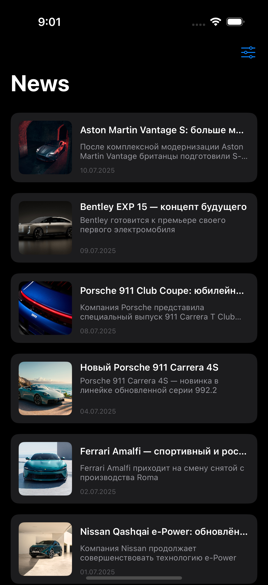

# AutoNewsFeed

AutoNewsFeed is a sample iOS application that displays news from the Autodoc API. The codebase is organised as a Swift Package to separate features into small modules.

## Requirements
- Xcode 15 or later
- iOS 15 SDK

## Building
1. Clone the repository
2. Open `AutoNewsFeed.xcworkspace` in Xcode
3. Select the *AutoNewsFeed* scheme and run on a simulator or device

Most of the logic lives inside the Swift Package located in the `Package` directory. The app target in `AutoNewsFeed` just bootstraps the coordinators from the package.

## Module overview

```
Package
└── Sources
    ├── Modules
    │   ├── App
    │   ├── NewsFeed
    │   └── NewsDetail
    └── Frameworks
        ├── API
        ├── AppNavigation
        ├── Formatters
        ├── Models
        ├── Network
        ├── Services
        ├── SupportKit
        └── UIComponents
```

- **Modules** contain high level features (the main application, feed screen and detail screen).
- **Frameworks** provide reusable pieces such as networking, models, formatting and UI components.

Each module can be developed and tested independently and then linked together through Swift Package Manager.

## Orientation and layout

The interface adapts to different orientations on iPhone and iPad. On iPhone the feed seamlessly rotates between portrait and landscape modes. On iPad, the feed displays two columns in portrait orientation and three columns when the device is rotated to landscape.

Cells support both the legacy and the new design styles so the UI looks consistent regardless of which layout is enabled.

## Screenshots

<!-- Placeholder images; replace with real screenshots from the simulator -->
<p align="center">
  
  
  
  
</p>

